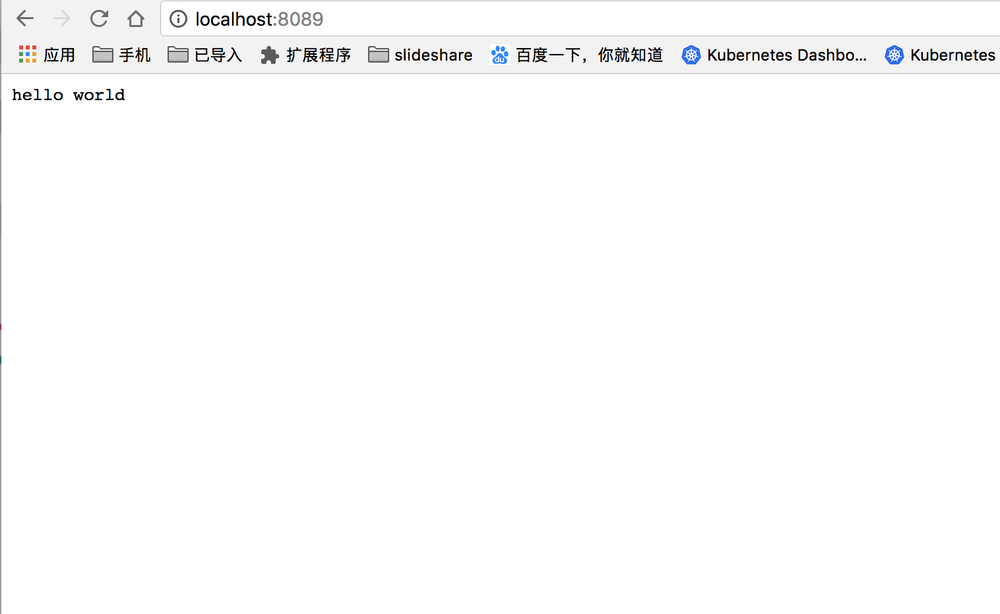
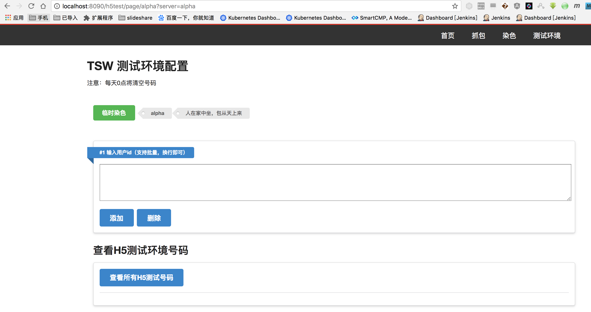

# Tencent Server Web  docker run

## How to run

```code
docker-compose buiuld
docker-compose up -d
```

## How to Access

```code

//service

http://hostip:8089 
// sky
http://hostip:8090

```

## some image



